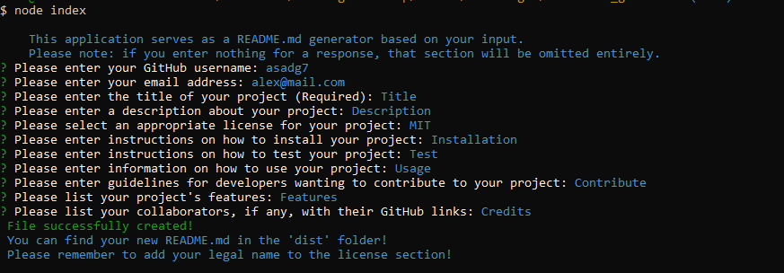
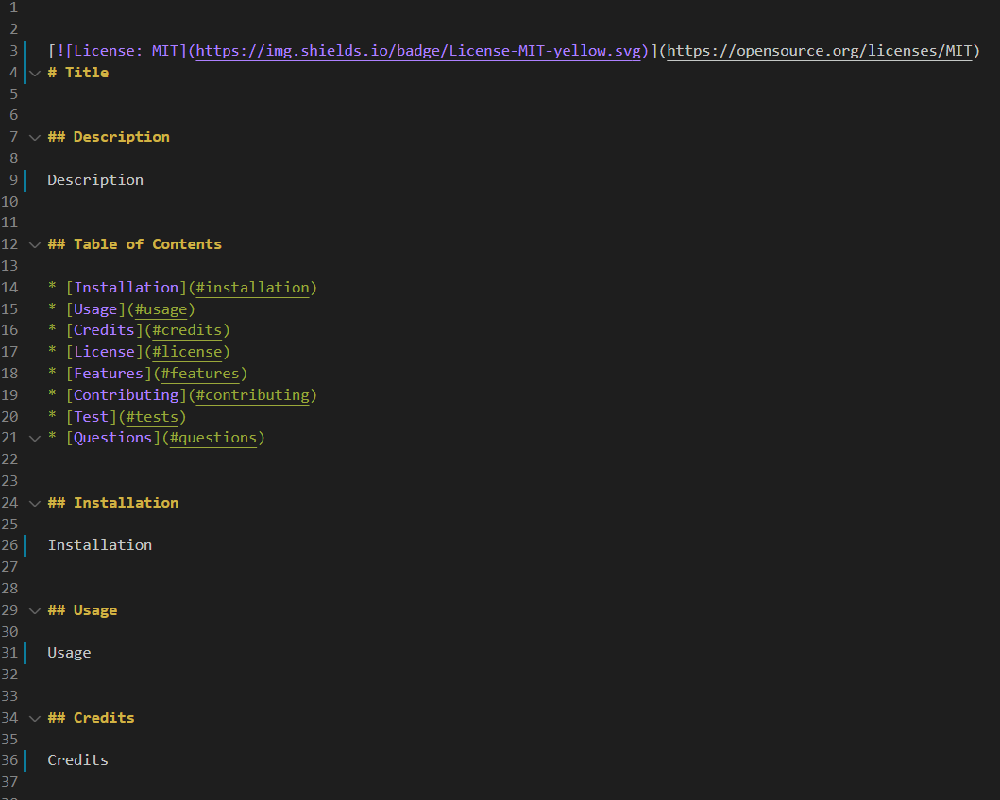
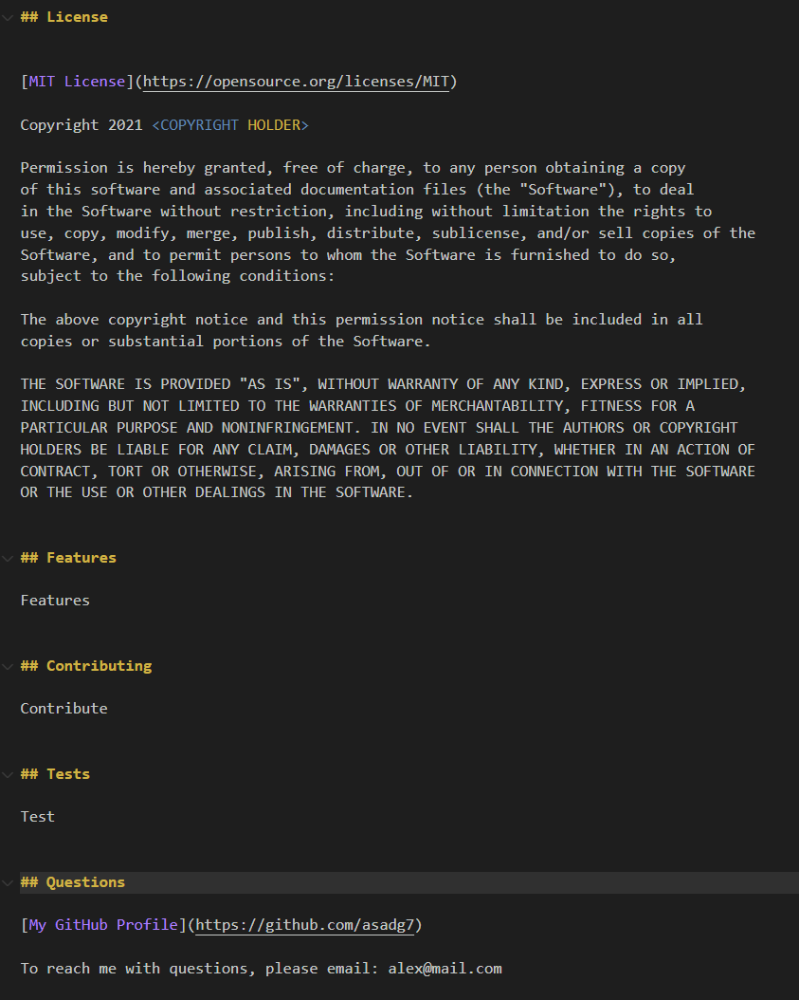

# README.md Generator

## Description

This project serves as a README.md generator. It is built using node.js, and in order for it to work it must be run through the terminal. It was my intent to make this generator as dynamic as possible while also adhering to the acceptance criteria. This is because if a user decides they don't want a certain section in their readme, they can simply enter nothing and it will not appear in the distributed readme. This also means having a dynamic table of contents that responds based on which prompts the user has answered.

Here is a walkthrough video explaining how the project works: https://watch.screencastify.com/v/UIlmXuTxW9NlEmaIdRg1

Screenshots

Welcome Message after node index.js

Finishing Message after prompts complete

Generated Readme Part 1

Generated Readme Part 2

## Table of Contents

* [Installation](#installation)
* [Usage](#usage)
* [Credits](#credits)
* [License](#license)
* [Features](#features)
* [Contributing](#contributing)
* [Test](#tests)
* [Questions](#questions)

## Installation

To install this project, first you would need to clone this repository to your local machine. Once cloned, make sure you are in the root of the project directory. Then, making sure you have node.js installed to your local machine, you would run the command "npm install inquirer" in your terminal. This would install the necessary inquirer package.

## Usage

To use this project, after following the installation instructions, you simply run the command "node index.js" in your terminal and then respond to the various prompt questions. A readme will be generated afterwards in the "dist" folder of the directory. There are also messages in the terminal to help you along the way.

## Credits

I didn't collaborate with anybody on this project.

## License

[MIT License](https://opensource.org/licenses/MIT)

Copyright 2021 Alex Sadrgilany

Permission is hereby granted, free of charge, to any person obtaining a copy 
of this software and associated documentation files (the "Software"), to deal 
in the Software without restriction, including without limitation the rights to 
use, copy, modify, merge, publish, distribute, sublicense, and/or sell copies of the 
Software, and to permit persons to whom the Software is furnished to do so, 
subject to the following conditions:

The above copyright notice and this permission notice shall be included in all 
copies or substantial portions of the Software.

THE SOFTWARE IS PROVIDED "AS IS", WITHOUT WARRANTY OF ANY KIND, EXPRESS OR IMPLIED, 
INCLUDING BUT NOT LIMITED TO THE WARRANTIES OF MERCHANTABILITY, FITNESS FOR A 
PARTICULAR PURPOSE AND NONINFRINGEMENT. IN NO EVENT SHALL THE AUTHORS OR COPYRIGHT 
HOLDERS BE LIABLE FOR ANY CLAIM, DAMAGES OR OTHER LIABILITY, WHETHER IN AN ACTION OF 
CONTRACT, TORT OR OTHERWISE, ARISING FROM, OUT OF OR IN CONNECTION WITH THE SOFTWARE 
OR THE USE OR OTHER DEALINGS IN THE SOFTWARE.

## Features

This project features a dynamic response based on if the user enters empty strings for certain responses, which also in turn creates a dynamic table of contents.

## Contributing

In order to contribute to this project, please fork this repo and make contributions on your own. Then if you think you have improved it, please see the questions section to reach out to me.

## Tests

In order to test this project, you should follow the usage instructions and then go into the "dist" folder of the project and make sure the readme that was generated matches the input that you gave in the terminal. You should also make sure no errors are logged to the terminal.

## Questions

[My GitHub Profile](https://github.com/asadg7)

To reach me with questions, please email: alex@mail.com